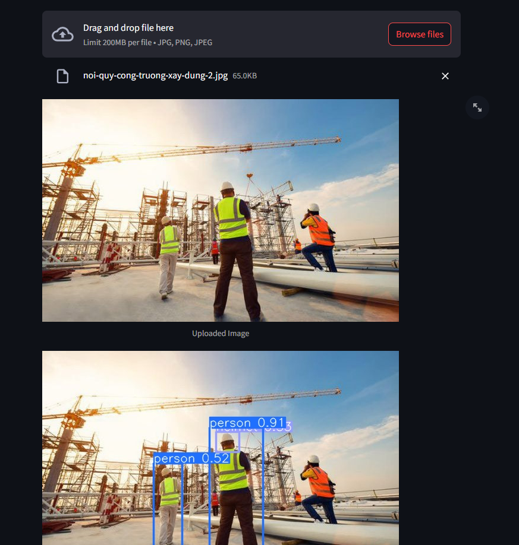
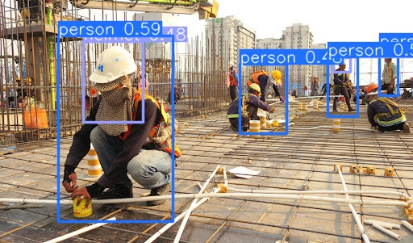
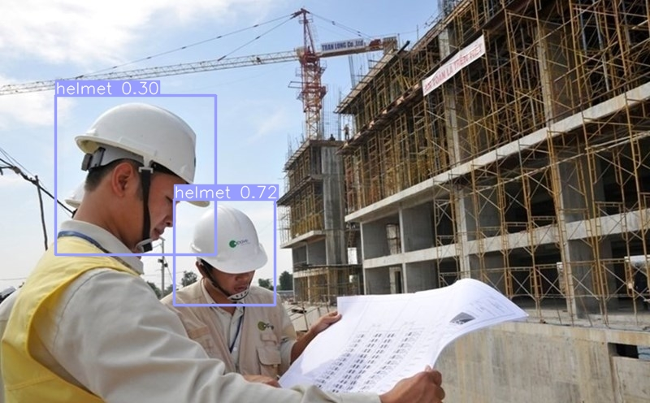

# YOLO (You Only Look Once) Project

Quickly implement and use YOLO models for real-time object detection with YOLOv10.

## Quick Start
1. **Installation**: `cd yolov10 && pip install .`
2. **Deployment**: Run `streamlit run .\deploy_model.py` to deploy with Streamlit.

## Resources
- **Model Source**: [YOLOv10 GitHub](https://github.com/THU-MIG/yolov10)
- **Directory Structure**:
  - `data`: Datasets
  - `models`: Model definitions/configurations
  - `predicts`: Prediction results
  - `yolov10`: YOLOv10 implementation
  - `deploy_model.py`: Streamlit deployment script

## Example
Deploy and detect objects in images after installation.
### Sample Image Predictions

  
  
  

## Acknowledgements
Thanks to [THU-MIG](https://github.com/THU-MIG/yolov10) for the YOLOv10 model.